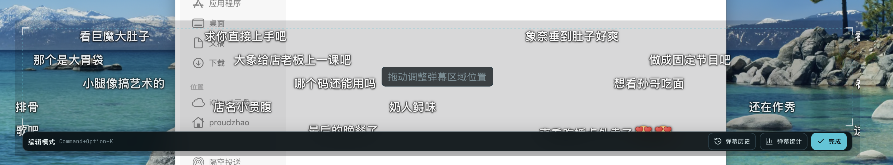
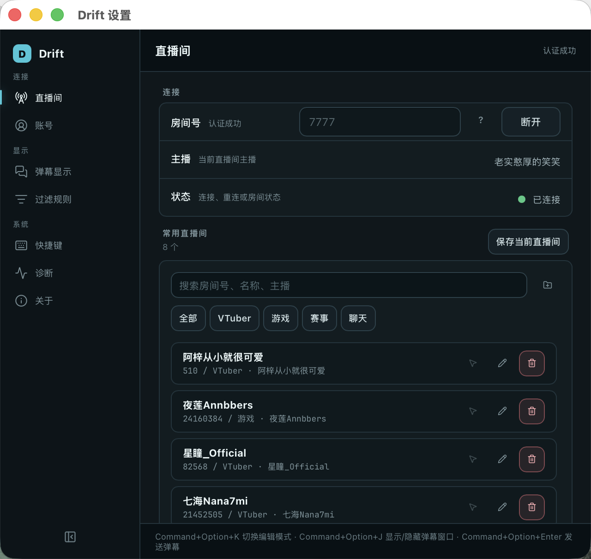

# Drift
>
> 本仓库基于 [proudzhao/Drift](https://github.com/proudzhao/Drift) `v0.9.0`（提交 `6af8b01`）修改而来。
> 本修改版同样以 MIT 许可发布。
> 本版本相对上游只有「一个新增功能 + 一个缺陷修复」

---

## 本版本相对上游的改动

| # | 类型 | 改动 | 影响范围 |
|---|------|------|----------|
| 1 | 新增功能 | 弹幕窗口左上角显示直播间**同接数**（B 站在线观看人数） | 前端 `App.tsx` / `App.css` + Rust 后端 4 个文件 |
| 2 | 缺陷修复 | 修复「发送弹幕」窗口无法选择目标直播间、完全发不出弹幕的问题 | 配置 `capabilities/default.json` |

### 1. 新增：弹幕窗口左上角显示同接数

在"已经连接直播间"时，弹幕悬浮窗左上角会出现一个胶囊形徽标，例如 `同接 1,419`。

实现要点：

- **数据来源**：直接解析 B 站直播 WebSocket 下发的 `ONLINE_RANK_COUNT` 协议包，
  依次尝试取其中的 `count`、`online_count` 字段。**不额外轮询 HTTP 接口**，不增加任何请求负担。
- **新增的职责链**：`protocol.rs` 的 `handle_packet` 返回值由 `Vec<LiveMessage>` 扩展为
  `(Vec<LiveMessage>, Option<u64>)`，由 `ws.rs` 收到后写入 `room_manager` 的房间快照，
  再经 `useRoomSessions` 传到前端。
- **显示条件**：仅当会话状态为 `connected` / `reconnecting` 且确实取到数值时才渲染；
  没有数据时自动隐藏，不留空白占位。
- **多房间**：按会话逐个渲染，多个直播间同时连接时会纵向排列。
- **样式**：左上角固定 8px 偏移，圆角胶囊、半透明深色底，跟随弹幕窗口的透明度设置。

涉及文件：`src-tauri/src/bilibili/{protocol,ws,room_manager,send/mod}.rs`、
`src/{App.tsx,App.css}`、`src/types/roomSession.ts`、`src/hooks/useRoomSessions.ts`。

### 2. 修复：发送弹幕窗口选不到目标直播间

**问题**：明明已经连接直播间（能正常收到弹幕），按发送弹幕快捷键打开窗口后，
"发送到"下拉框里却只有"请选择目标"，目标为空、发送按钮禁用，导致完全无法发送弹幕。

**根因**：`drift/src-tauri/capabilities/default.json` 里的窗口白名单是
`["main", "control", "help"]`，**漏掉了运行时动态创建的 `send` 窗口**。
Tauri 2 的权限是按窗口粒度授权的，未匹配到任何 capability 的窗口将**没有任何插件权限**；
于是前端 `useRoomSessions` 的第一步 `listen("bilibili-room-sessions")` 被 ACL 拒绝，
异常被 `catch` 吞掉后 `sessions` 恒为空数组，下拉框自然什么都没有。

这也解释了为什么"主窗口能收弹幕、发送窗口却拿不到房间"——主窗口在白名单里，发送窗口不在。

**修复**：把 `"send"` 加入该白名单。重新构建后，发送窗口即可正常枚举已连接直播间。

---

以下是原项目 README 的完整内容（未作改动）：

---

Drift 是一款桌面顶层透明弹幕悬浮工具。它可以连接 B 站直播间，把实时弹幕显示在桌面透明窗口上，适合边听直播，边学习、工作或打游戏时使用。

> 小提示：独占全屏游戏通常会遮住桌面悬浮窗口。如果想在游戏时显示弹幕，建议把游戏显示模式调整为“无边框窗口”或“窗口化全屏”。

## 功能特性

- B 站直播间弹幕实时接入。
- 透明、置顶、无边框弹幕窗口。
- 鼠标穿透显示模式，不影响操作桌面和其他应用。
- 支持 B 站扫码登录，登录凭据保存在系统安全存储中。登录并连接直播间后，可通过快捷键打开发送窗口发送普通文本弹幕。

## 界面预览

普通显示模式：


编辑模式：



设置页面：



## 下载安装

前往 Releases 页面下载：

[Download Drift](https://github.com/proudzhao/Drift/releases)

macOS 用户下载 `.dmg` 文件：

- Apple Silicon：下载 `aarch64.dmg`
- Intel Mac：下载 `x64.dmg`

Windows 用户下载 `.exe` 或 `.msi` 安装包。

> 当前版本尚未进行 macOS Developer ID 签名和 Apple 公证。macOS 可能会提示“无法验证开发者”或“应用已损坏，无法打开”。如果你确认安装包来自本仓库 Releases 页面，可以将应用拖入“应用程序”后执行：
>
> ```bash
> xattr -dr com.apple.quarantine /Applications/drift.app
> ```

## 基础使用

1. 启动 Drift。
2. 打开设置窗口。
3. 在“直播间”页输入 B 站直播间房间号。
4. 点击“连接”。
5. 弹幕会显示在透明悬浮窗口中。
6. 调整好窗口区域后，点击“完成”进入鼠标穿透显示模式。

默认快捷键：

```text
切换编辑模式
macOS: Command+Option+K
Windows / Linux: Control+Alt+K

显示或隐藏弹幕窗口
macOS: Command+Option+J
Windows / Linux: Control+Alt+J

打开发送弹幕窗口
macOS: Command+Option+Enter
Windows / Linux: Control+Alt+Enter
```

如果快捷键与其他应用冲突，可以在设置窗口的“快捷键”页修改。

## 设置说明

设置窗口包含以下页面：

- 直播间：连接或断开直播间，查看主播名称，管理常用直播间、自定义分组和搜索。
- 弹幕显示：调整字号、透明度、滚动速度、显示密度、用户名显示和消息类型开关。
- 过滤规则：添加高级过滤规则，用于隐藏或高亮指定弹幕。
- 快捷键：修改编辑模式、弹幕窗口显示/隐藏、发送弹幕窗口快捷键。
- 诊断：测试 B 站 API 链路，打开日志目录，导出诊断报告，启用 Mock 弹幕测试。
- 账号：扫码登录 B 站，查看账号状态，校验登录态，退出登录。
- 关于：查看当前版本，手动检查更新。

## 登录与发送弹幕

发送弹幕需要先登录 B 站，并且当前已经连接直播间。

推荐流程：

1. 打开设置窗口的“账号”页。
2. 点击扫码登录，并使用 B 站客户端扫码确认。
3. 回到“直播间”页连接直播间。
4. 使用发送弹幕快捷键打开发送窗口。
5. 输入普通文本弹幕后按 Enter 或点击发送。
6. 点击“x”按钮 或 按下 Esc 按键关闭发送窗口

发送说明：

- Drift 只支持普通文本弹幕发送。
- 单条弹幕长度限制为 60 个 Unicode 字符。
- 本地会限制连续发送频率，避免误触造成高频发送。

## macOS 钥匙串密码提示说明

在 macOS 上使用扫码登录、校验登录状态、发送弹幕或退出登录时，系统可能会弹出“Drift 想要访问钥匙串”之类的密码窗口。这是 macOS Keychain 的系统安全机制，不是 Drift 自己绘制的密码框，也不是在索要你的密码。

Drift 使用钥匙串保存 B 站登录后得到的 Cookie 信息，目的是避免把敏感登录凭据明文写入配置文件。保存项使用：

```text
Service: com.proudzhao.drift.bilibili.auth
Account: bilibili-cookie-bundle
```

需要强调：

- Drift 不会读取、保存或上传你的 macOS 登录密码。
- macOS 密码只由系统钥匙串窗口接收，用于确认你允许 Drift 访问它自己保存的 B 站登录凭据。
- Drift 的诊断报告和日志不会输出完整 Cookie、`SESSDATA`、`bili_jct`、`refresh_token` 或完整请求头。
- 如果你拒绝钥匙串访问，Drift 仍可匿名接收弹幕，但账号状态、登录态请求和发送弹幕可能不可用。

如果你不想继续保留登录状态，可以在设置窗口“账号”页点击退出登录，Drift 会删除本机保存的 B 站登录凭据。

## 诊断与反馈

如果连接失败、登录状态异常或发送弹幕失败，可以在设置窗口“诊断”页：

1. 点击“测试 API”检查当前直播间相关 B 站接口。
2. 点击“打开日志目录”查看本机日志。
3. 点击“导出诊断报告”生成文本报告。

诊断报告会包含应用版本、系统信息、最近日志、当前配置、B 站认证状态和弹幕发送状态。报告会做脱敏处理，不会包含完整 Cookie、CSRF 或弹幕正文。

## 本地开发

项目基于 Tauri、React、TypeScript 和 Rust。

环境要求：

- Node.js
- npm
- Rust
- Tauri 所需系统依赖

安装依赖：

```bash
cd drift
npm install
```

启动开发模式：

```bash
npm run tauri dev
```

构建应用：

```bash
npm run tauri build
```

## 项目结构

```text
Drift/
├── drift/
│   ├── src/              # React / TypeScript 前端
│   ├── src-tauri/        # Tauri / Rust 后端
│   ├── package.json
│   └── vite.config.ts
├── .github/workflows/    # GitHub Actions 发布流程
├── assets/               # README 截图资源
└── README.md
```

---

## 许可与致谢（本 Fork）

- 本项目派生自 [proudzhao/Drift](https://github.com/proudzhao/Drift)，原作者为 **proudzhao**，
  **MIT License, Copyright (c) 2026 proudzhao**。原项目的 `LICENSE` 文件完整保留。
- 本 Fork 的修改部分同样以 **MIT** 许可公开发布，可以自由使用、修改和再发布，
  只需保留上述版权声明与许可证全文即可。
- 项目依赖的 Rust crates 与 npm 包各自遵循其原作者许可证，此处一并致谢。
- GitHub Actions 工作流与 Release 相关配置沿用上游，**本 Fork 未自建发布流程**。

## 已知注意事项

- 本版本**未修改**应用内置自动更新的地址，它仍指向上游 `proudzhao/Drift` 的 Release。
  若你不希望被上游版本覆盖，请在设置窗口关闭"启动时检查更新"，或自行修改
  `drift/src-tauri/tauri.conf.json` 中的 updater 配置后再构建。
- 发送弹幕功能需要 B 站账号扫码登录，且单条弹幕限制 60 个 Unicode 字符，
  这些限制与上游保持一致。

## 免责声明

本项目仅供学习与技术交流使用，与 bilibili 官方无关，也未使用任何官方私有接口。
弹幕数据来自公开的直播间 WebSocket 通道。请勿用于任何违反平台规则的用途，
由此产生的一切后果由使用者自行承担。
